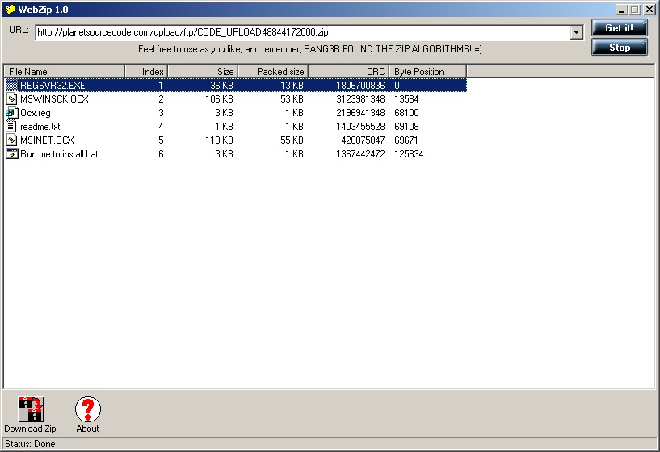



## WebZip \- Update for Online Zip Browser \(I\)

### Description

This program is an update for the code that Rang3r posted (Online Zip Extractor). This version has an improved GUI, a ping feature, checking for resumable servers, and checking to make sure the ZIP file exists. GetIcon function by Tom de Lange and skinned buttons by J. Pearson.
 
### More Info
 
KNOWN BUG: Stop button sometimes doesn't close Winsock for unknown reasons.

             |
---                |---
**Submitted On**   |2001-08-01 20:09:10
**By**             |[Jonathan Smith](https://github.com/Planet-Source-Code/PSCIndex/blob/master/ByAuthor/jonathan-smith.md)
**Level**          |Advanced
**User Rating**    |4.8 (43 globes from 9 users)
**Compatibility**  |VB 5\.0, VB 6\.0
**Category**       |[Complete Applications](https://github.com/Planet-Source-Code/PSCIndex/blob/master/ByCategory/complete-applications__1-27.md)
**World**          |[Visual Basic](https://github.com/Planet-Source-Code/PSCIndex/blob/master/ByWorld/visual-basic.md)
**Archive File**   |[WebZip \- U23960822001\.zip](https://github.com/Planet-Source-Code/jonathan-smith-webzip-update-for-online-zip-browser-i__1-25781/archive/master.zip)

